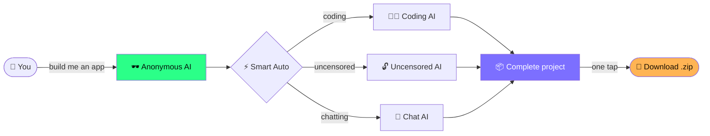

<div align="center">

# 🕶️ Anonymous AI

### *Your no-leash AI coding partner — build whole apps from your phone, free.*


`// PRIVATE · UNRESTRICTED · YOURS`

</div>

---

## 🤔 What is this? (in plain English)

Anonymous AI is a **chat app you install on your phone** that lets you talk to powerful AI models — and have them **build entire apps for you**.

You don't write code. You just say *"build me a ___"* and it writes every file, complete and ready to use.

Think of it like texting a genius programmer who never sleeps, never charges you, and never says *"I can't help with that."*

> 💡 **The whole thing is one file.** No installing, no accounts, no monthly fees. Open it, paste a free key, start building.

---

## ✨ What can it do?

| 🎯 Feature | 💬 What it means for you |
|---|---|
| 🔨 **Builder Mode** | Tap a template (or describe anything) and it generates a **whole project** — every file, ready to run |
| 🤖 **Many free AIs** | Switch between coding brains, chat brains, and **uncensored** models — all free |
| ⚡ **Smart Auto** | Don't know which AI to pick? Auto picks the best one **and switches if one breaks** |
| 🔓 **Unrestricted** | Uncensored models for when normal AIs refuse to help |
| 📦 **One-tap downloads** | Save any file, or grab a **whole project as a .zip** |
| 📎 **Send it files** | Upload your code or screenshots and the AI reads them |
| 🎤 **Talk to it** | Voice input — speak instead of typing |
| 🎨 **Make it yours** | Themes, fonts, colors, animated backgrounds, 3D effects |
| 💾 **Never lose work** | Every chat saves automatically, searchable, exportable |
| 🚀 **One-tap GitHub push** | Save any build straight to GitHub — **no terminal, no git** |
| ▶️ **Live Preview** | Built an HTML app? See it **run right on your phone** instantly |
| 🔊 **Read aloud** | The AI reads its answers out loud |
| ➡️ **Keep going** | One tap continues a cut-off answer |
| ⚡ **Slash commands** | Type `/build`, `/fix`, `/explain` for instant actions |
| 📱 **Feels like a real app** | Add to home screen → fullscreen, no browser bars |

---

## 🚀 Get started in 3 taps

```
  1️⃣  Open the app  →  2️⃣  Paste your free key  →  3️⃣  Start building
```

### Step 1 — Get a free key 🔑
- Go to **[openrouter.ai](https://openrouter.ai)** → **Sign Up** (free, no card)
- Open **Keys** → **Create Key** → copy it
- ⚙️ Important: in **Settings → Privacy**, turn ON *"Free endpoints that may train on request data"* so the free models work

### Step 2 — Open the app 📲
- Open `index.html` in **Chrome**
- Paste your key when it asks

### Step 3 — Make it an app 🏠
- Chrome menu (⋮) → **Add to Home Screen**
- Now it opens fullscreen, just like any app

---

## 🧠 How it works (the simple version)



**In words:** You ask → Auto picks the best free AI → if that one's busy it tries another → you get a complete app → download it. No dead ends, no terminal, no payments.

---

## 🤖 The AI models

| Brain | Best for | Free? |
|---|---|---|
| ⚡ **Auto — Coding** | Building apps & scripts | ✅ |
| 🔓 **Auto — Uncensored** | When other AIs refuse | ✅ |
| 💬 **Auto — Chatting** | Questions & ideas | ✅ |
| 🧑‍💻 Nemotron, Kimi, Laguna, GPT-OSS | Heavy coding | ✅ |
| 🔓 Venice (Dolphin), DeepSeek R1 | Unfiltered answers | ✅ |

> 🛡️ **Powered by two free sources** — OpenRouter (main) and Chutes (backup). If one model goes down, Auto quietly switches to a working one so you're never stuck.

---

## 🛠️ Builder Mode templates

<div align="center">

| 🌐 Web | 📱 App / Tool | 🎮 Game / Fun | 🐍 Script |
|---|---|---|---|
| Landing Page | PWA (installable) | Roblox System | Python CLI |
| React SPA | Chrome Extension | Canvas Game | FastAPI |
| REST API | Discord Bot | Idle / Clicker | Web Scraper |
| Full-Stack App | Telegram Bot | | Automation |

</div>

*...or just describe your own and pick the language. It builds the whole thing.*

---

## 🔒 Is my stuff private?

- 🔑 Your API key is stored **only on your phone** — it never goes anywhere except to the AI
- 💬 Your chats are saved **on your device**, not on any server
- ⚠️ Heads up: free models *can* use what you type to improve themselves, so don't paste passwords or private personal info into them. Fine for coding and everyday stuff.

---

## ❓ Quick FAQ

<details>
<summary><b>💸 Is it really free?</b></summary>
<br>
Yes. The AI models are free-tier (no credit card). You may hit a daily limit on heavy use, but Auto-switching helps stretch it.
</details>

<details>
<summary><b>📵 Does it work offline?</b></summary>
<br>
The app opens, but the AI needs internet to think. (Offline shell caching is on the roadmap.)
</details>

<details>
<summary><b>🏃 Can it RUN the apps it builds?</b></summary>
<br>
It writes them complete and ready. Simple HTML apps can preview right in the app (roadmap). Bigger projects you run on a computer or free host.
</details>

<details>
<summary><b>🤖 Why "uncensored"?</b></summary>
<br>
Normal AIs sometimes refuse legitimate coding or research help. Uncensored models answer directly. Use them responsibly.
</details>

---

<div align="center">

### Made for builders who don't write code. 🕶️

`anon█ai`

</div>
